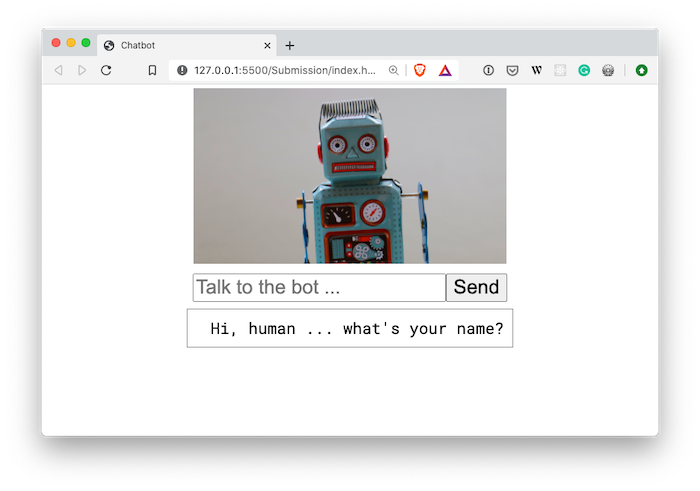

# 01 Project - Build a Chatbot

Write logic for a chatbot to reply to user input

---

## Assessment details

- [Level 5 Learning Outcomes](./docs/learning-outcomes-l5.md)
- [Level 6 Learning Outcomes](./docs/learning-outcomes-l6.md)
- [Marking criteria](./docs/marking-criteria.md)

---

## Project Brief

Build a chatbot that helps your customer solve a problem. Your customer will be able to enter text into a form, and your bot should analysis the text and respond accordingly.



---

## Rationale

This project is the combination and application of things you have learnt about JavaScript so far.

Use conditionals, comparisons, and built-in methods such as string and array methods, to apply logic to a program. Write functions and leverage scope to give your bot a memory.

---

## Getting Started

1. `clone` the project repository to your local computer using VS Code
2. The code for this project should go into `/Submission/static/js/script.js`.
3. Read through this entire document before you begin

---

## Instructions Part A - Solving a problem

<details>
<summary>Solving a problem</summary>
<br>

You are going to build a helpful chatbot, that will solve a problem for your customer. Your chatbot should have its own personality, and the problem it solves can be anything you like.

Some examples of problems that your chatbot could help with:

- What should I have for dinner? ([example](https://www.tasteofhome.com/article/what-should-i-make-for-dinner/))
- What movie should I watch? ([example](https://www.buzzfeed.com/spenceralthouse/what-movie-should-i-watch-tonight-quiz))
- Ordering a Pizza to be delivered ([example](https://www.youtube.com/watch?v=DU4m_mJP0Uo))
- A self care Chatbot ([example](https://philome.la/jace_harr/you-feel-like-shit-an-interactive-self-care-guide/play/index.html))

Once you have decided on what problem your Chatbot will solve, write a problem statement. This should include what problem your Chatbot will solve for customers. Use a tool like Grammarly to help fix spelling and grammatical errors.

**Acceptance criteria**

- Write the problem statement that your Chatbot will be solving for a customer in the file located at `Submission/planning/problem.md`
  - Optional: You can use Markdown text formatting in your `problem.md` file. See [Mastering Markdown](https://masteringmarkdown.com/) by Wes Bos to learn how to use markdown.
- Commit this change to git

</details>

## Instructions Part B - Planning

<details>
<summary>Plan your Chatbot</summary>
<br>

Now you have your problem defined, it's time to plan how to implement the Chatbot.

Draw some flow charts to determine the paths that customers can take when talking to the Chatbot. Don't forget to plan for situations when your Chatbot cannot understand the reply from the customer. You can draw your flow chart by hand, or use online tools such as [Excalidraw](https://excalidraw.com/) or [Miro](https://miro.com/)

Think about what information you need from the customer at each point, and determine how you can understand the customer using JavaScript. Also, think about what you need the Chatbot to ask and reply with to be able to progress to the next step in your flow chart.

Your Chatbot conversation should have at least 2 paths the customers can follow. For example, if you are building a Chatbot to help your customer choose a movie, you might ask them if they like Action or Romance, meaning there are two possible paths.

Your chatbot should also show some personality, maybe it tells jokes, or offers advice when asked.

Based on your flowchart, write down a couple of test scenarios, where you list the inputs, and the outputs. An example might look like this:

```
## Test scenarios

Do you like Romance or Action movies? Action
I recommend Total Recall. Are you happy with this suggestion? No
In that case I recommend Point Break. Are you happy with this suggestion? Yes
Enjoy your movie!
```

You can add more test scenarios as you need.

**Acceptance criteria**

- Flow chart graphics are added to the `Submission/planning` folder
  - **Note:** Taking pictures of hand-drawn flow charts is fine
  - Flow charts have at least two paths
  - Flow charts take into account the acceptance criteria for Part C
- Test scenarios are added to `Submission/planning/problem.md`

**Note:** It is expected that plans change, so it's fine if what you plan doesn't match the end result. However, reflect on how you got to the end result in your feedback.

</details>

## Instructions Part C - Add automated testing for your chatbot

<details>
<summary>Add automated testing for your chatbot</summary>
<br>

Writing automated tests for your JavaScript is an industry standard practice.

Open `/test/script.test.js`, and watch the video tutorial below to understand how to write automated tests for your chatbot. **Important** watch the whole video through before attempting to follow along.

[Write automated tests for your Chatbot](https://www.loom.com/share/debdef7b19644366a4cd385fa0aa0b89)

**Acceptance criteria**

- Automated tests are written and pass for test scenarios 

</details>

## Instructions Part D - Implementing your Chatbot

<details>
<summary>Implementing your Chatbot</summary>
<br>

Use your plan to break down your project into small tasks. Don't try and do everything at once, it will be overwhelming.

It's a good idea to break down your tasks as tiny as possible. Only implement one test scenario at a time

**Acceptance criteria**

- The chatbot asks for the customers name, and refers to the customer by their name where appropriate
- The chatbot asks a series of questions to the customer, which are used to solve the problem
  - There should be at least two paths the customer can follow
- The chatbot can respond to at least two questions from the customer, at any time during the conversation
  - For example: restart, turn on dark mode (this might change the page design to use a black background), or help
- If the chatbot doesn't understand the customer, it offers helpful messages so the customer can continue
  - For example: "I couldn't understand your reply, try answering 'yes' or 'no'"
- The chatbot has it's own page design and personality
- Commits to git are regular through the implementation process, with commit messages that explain the change being made in the commit
  - For example "Chatbot replies with a random joke when asked"

</details>

---

# Submit your Project

- [ ] Commits are pushed to GitHub
- [ ] Automated tests pass in GitHub

**Note** there are no automated tests for this project

---

<details>
  <summary>
    Git CLI Refresher
  </summary>

If you need help remembering what commands to type with `git`, use the following as a reference, or watch the [git walkthrough tutorial video](https://vimeo.com/433825571/bc1830fb90)

```shell
# when ready to commit and push
git add .

git commit -m "Made the chatbot tell me a joke"

git push origin master
```

</details>
